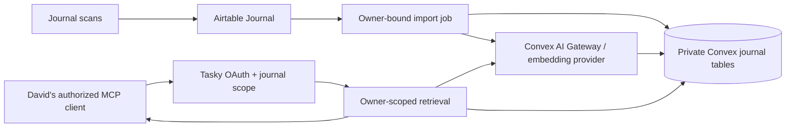

# Private journal RAG in Tasky

Design report, 2026-10-08. This records the original proposal and investigation.
See [the implementation runbook](journal-operations.md) for the implemented
behavior, deployment setup, and remaining operational boundaries.

## Recommendation

Extend Tasky's existing authenticated MCP endpoint with journal retrieval tools. Store journal text and embeddings in dedicated Convex tables. Use Convex AI Gateway for hosted embedding generation, subject to confirming this team's access and its data-processing terms. Keep Airtable Journal as the source of truth. Fully replace Nomic with the new hosted embedding profile: no legacy vector import, dual-model query path, or ongoing local embedding dependency.

The security rule is: **an authenticated principal can retrieve journal data only from a corpus owned by that exact principal, and an MCP grant must additionally contain the required journal scope.** The tables and authorization logic support multiple users from the outset; initially every production journal row belongs to David's production account, including corpus, profile and sync metadata. Email is used to identify that account during setup, never to authorize a request.

This prevents other ordinary Tasky users and their MCP clients from accessing David's journal through the application. It is not end-to-end encryption: deployment administrators, cloud infrastructure, the selected embedding service, and a client David authorizes are inside the trust boundary. No implementation can honestly promise immunity to every future bug, stolen credential, or privileged operator. The release conditions below turn the application isolation requirement into something testable.

## Verified current state

Read-only Convex CLI inspection found:

| Item | Verified value |
|---|---|
| Account | David Wetterau, `david.wetterau@gmail.com`, email verified |
| Production deployment | `pleasant-nightingale-894` |
| Production Better Auth user ID | `k5796cc6dv7tvdr88hjcajfeyd7zzfwf` |
| Production MCP URL | `https://pleasant-nightingale-894.convex.site/api/mcp` |
| Development deployment | `courteous-bat-217` |
| Development Better Auth user ID | `k576ebvm78df5emdxe0x8wrhts7zprnq` |
| Production app ownership | An existing task and user settings use the production ID above; timezone is `America/New_York` |
| Production journal tables | None present |

The user IDs belong to Better Auth's component `user` table. Tasky's application tables use string `userId` references to those IDs, not a root `users` table. Development and production IDs are different; never copy the development ID into a production import.

Read-only inspection of `../knit3/data/sample.sqlite` found 3,070 active journal records and 3,070 matching vectors, with zero pending embeddings. Dates run from 2018-04-15 through 2026-09-14. Text totals 4,256,931 UTF-8 bytes; the largest entry is 1,768 bytes. These figures describe the local snapshot, not today's Airtable contents.

The last full fetch/index completed on 2026-09-20; a later three-record sample does not establish freshness. Model: `nomic-embed-text:v1.5`, 768 dimensions, digest `0a109f422b47e3a30ba2b10eca18548e944e8a23073ee3f3e947efcf3c45e59f`, document prefix `search_document: `, query prefix `search_query: `. Whole records are embedded without splitting. Memories and Reflections are outside this design.

Relevant existing code:

- [convex/auth.ts](../convex/auth.ts): GitHub login, Better Auth, MCP OAuth configuration, scope advertisement, and `getAuthUserId()`.
- [convex/mcp.ts](../convex/mcp.ts): `/api/mcp` handler authenticates with `withMcpAuth`, reads `session.userId`, and calls internal functions with that owner.
- [convex/mcpScopes.ts](../convex/mcpScopes.ts) and [convex/mcpTools/widgets.ts](../convex/mcpTools/widgets.ts): explicit scope checks and a reusable tool-handler structure.
- [convex/lib/mcp.ts](../convex/lib/mcp.ts): isolates homepage OAuth grants from MCP.
- [src/lib/oauth.ts](../src/lib/oauth.ts) and [consent page](../src/app/oauth/consent/page.tsx): permission descriptions and consent flow.
- [convex/schema.ts](../convex/schema.ts): owner indexes and owner-filtered text search for existing app data.
- [convex/migrations.ts](../convex/migrations.ts): installed migration component for future schema backfills.

No remote records, tokens, scopes, schemas, or deployment settings were changed during this investigation. No journal text was sent to an embedding provider.

## Architecture and hosted embeddings

Convex now offers a managed AI Gateway with an embeddings endpoint, available to paid teams. Its setup documentation explicitly demonstrates `openai/text-embedding-3-small`. Gateway credentials are short-lived, deployment-scoped service tokens obtained inside actions. They must never be returned to clients. [Gateway overview](https://docs.convex.dev/ai-gateway/overview), [embedding setup](https://docs.convex.dev/ai-gateway/setup).

Use `text-embedding-3-small` with 1,536 dimensions as the initial hosted profile. Embed the whole Entry text; use no Nomic-specific prefixes. This is a starting choice to evaluate against real journal questions, not a claim that it is universally the best model. [OpenAI embedding documentation](https://developers.openai.com/api/docs/guides/embeddings).

Tasky's installed Convex package is 1.45.0 and exposes `getServiceToken("ai-gateway")`. A small internal `fetch` adapter can call `/v1/embeddings` without adding a RAG framework. Alternatively the documented AI SDK adapter is available. Verify entitlement and one synthetic request before importing private text; this report did not invoke the gateway. If unavailable, configure a direct provider key in Convex server environment variables behind the same adapter.

Use native tables/indexes first. The RAG component is optional, but adds document/chunk/namespace machinery that these short whole-entry records do not need. Its namespace is not a replacement for authorization. [Convex RAG component](https://github.com/get-convex/rag).

**Model transition:** re-embed every imported Entry with the hosted model and use that one profile for both indexing and queries. Do not upload Nomic vectors or implement a compatibility path. Keep the old local database only as a temporary migration backup, not an active search backend; retire its MCP registration and synchronization after cutover. Matching dimension counts alone never establish model compatibility.

## Proposed data model

Every journal data table carries an immutable `userId`. References between rows must have matching owners and corpus IDs. Indexes organize data; they do not themselves enforce access control.

| Table | Principal fields and indexes |
|---|---|
| `journalCorpora` | `userId`, enabled/readiness state, server-controlled Airtable base/table binding, active embedding profile, corpus revision, last successful fetch/index times, sync lease. Unique-by-convention transactional lookup through `by_user`. Initially provision only David's production corpus. |
| `journalEntries` | `userId`, `corpusId`, stable `sourceKey`, Airtable record/base/table IDs, journal `date`, exact `text`, text hash, metadata hash, active state, revision, source-modified time when available, last-seen run, embedding state. Indexes `by_user_source` and `by_user_corpus_active_date`. Full-text index on `text` with owner, corpus and active filters. |
| `journalEmbeddings` | `userId`, `corpusId`, `entryId`, `profileId`, content hash, journal date, vector, server-derived `partition`, embedding timestamp. Lookup by entry/profile and by partition/date. Native vector index on the 1,536-dimensional array, filtered by `partition`. Remove stale vectors when text changes or an entry becomes inactive. |
| `journalEmbeddingProfiles` | `userId`, provider/gateway, requested and returned model identifiers, dimensions, document/query preprocessing, normalization, format version, revision/digest if available, creation time. Store that hosted model digests are unavailable when they are; do not invent a reproducibility guarantee. |
| `journalSyncRuns` | `userId`, `corpusId`, run ID, source and scope, status, pagination/checkpoint state, counts, timestamps, retry progress and sanitized error codes. Never store entry bodies or provider response bodies in errors. |

The server constructs `partition` from a collision-safe encoding of `[userId, corpusId, profileId]`. Clients cannot provide it. Only active, current vectors are searchable in the selected profile partition. V1 has one hosted profile and one current vector per active entry, with no generation machinery. Keeping vectors separate avoids loading large arrays for date retrieval; retrieval responses never expose vectors.

Keep the original Knit3 source ID as `sourceKey` so citations survive the migration. Return that ID, date, source URL, content hash, and full text or a clearly marked excerpt. A date is not a unique identity. A future reflection record can cite `{sourceKey, contentHash, date, url, quote?}`; its targets must have the same owner. Do not implement reflection tables, writes, or scopes in this first version.

## Privacy boundary and authorization

For every journal MCP request:

1. Validate the bearer grant, expiry, intended resource, client, and existing user. Require the journal scope before any database retrieval or embedding call.
2. Resolve `userId` exclusively from that grant. Resolve the enabled corpus using that ID. No default David ID, email argument, client-supplied owner, source URL, or corpus selector.
3. Use internal Convex queries/actions for journal operations. Pass the verified principal explicitly because an HTTP OAuth grant is not automatically the same thing as a Convex browser identity.
4. Restrict the database query/search to that owner and corpus before selecting results. Recheck ownership, active state, profile and content hash when hydrating vector hits or resolving IDs.
5. Return only selected result fields. Unauthorized IDs look missing; errors and status reveal no other user's counts, dates, hashes or existence.

Internal functions are inaccessible to ordinary Convex clients, but remain callable by privileged CLI/dashboard operators. If a first-party journal UI is later added, its public functions must derive the owner through `getAuthUserId(ctx)` and apply the same corpus policy; never export a public function accepting arbitrary `userId`. [Convex internal functions](https://docs.convex.dev/functions/internal-functions).

Initially, enrollment is an internal administrative operation that binds the verified production ID and configured Journal source. That ID belongs in the bootstrap manifest/binding, never in generic query logic or a special-case auth bypass. All indexes, source identities, uniqueness checks, caches and jobs are owner-scoped from day one. A different user cannot enroll themselves into David's source, even if they obtain a journal scope for their own account. Later enrollment provisions another user's separately authorized source/corpus using the same tables and code; it does not require copying tables or weakening ownership checks.

Do not put journal contents in `notes`, `captures`, `events`, widgets, homepage exports, analytics, or notifications. Those surfaces have different scopes and publication rules. Existing task/tag scopes confer no journal access. Do not use public storage links for journal exports.

Use `Cache-Control: private, no-store` for private MCP responses, including errors. Any application cache or continuation cursor must bind owner, corpus, filters and profile; validate against the authenticated owner on every continuation. Avoid a response cache initially. Do not log request bodies, search phrases, text, vectors, authorization headers, or provider error bodies. Audit only minimal access metadata with a defined retention policy.

### Auth work required before importing journals

Local source inspection found concrete gaps worth fixing before adding this more sensitive data. These are source-level findings, not a claim of a live production exploit or a completed penetration test:

- Installed Better Auth **1.4.9** `getMcpSession` looks up `oauthAccessToken` by bearer value and returns the record without checking `accessTokenExpiresAt`. `withMcpAuth` checks only that this record exists. Tasky's wrapper currently excludes the homepage client, but does not add an expiry check. Add fail-closed expiry/user/client validation at the shared boundary.
- The refresh branch creates a new grant without visibly consuming the old refresh grant. Establish effective revocation and refresh-token rotation, including all grant descendants. Revoking consent must invalidate existing access and refresh tokens, not merely hide tools.
- MCP configuration does not explicitly require S256 PKCE; the installed plugin permits plain challenges by default. Require PKCE and disable plain challenges, with compatibility checks for existing clients.
- The installed resource path authenticates opaque database-backed access tokens. A configured JWT plugin audience does not demonstrate resource validation on that path. Bind grants to the Tasky MCP resource, preserve homepage isolation, and reject tokens meant for another service.
- `tools/list` currently returns all descriptors irrespective of scopes. Filter journal descriptors to entitled principals, and independently enforce scopes on `tools/call`. Hiding descriptors alone is not authorization.
- The shared response helper currently lacks `no-store`. Add it for private responses. The token-session endpoint currently returns the provider grant shape; ensure public responses do not expose refresh credentials or unnecessary grant internals.

These checks belong in the auth adapter/shared boundary, not scattered through journal handlers. Prefer a supported provider upgrade if it supplies the required behavior and passes the existing homepage/MCP compatibility suite; otherwise implement narrowly reviewed guards. Before release, verify the actually deployed behavior as well as local source.

The consent UI currently derives permission labels from URL parameters. For sensitive new grants, render client identity and scopes from the server's pending authorization transaction, and require fresh consent when requested permissions expand. Never silently add journal access to an existing grant. MCP resource validation is also an explicit part of the protocol's authorization model. [MCP authorization specification](https://github.com/modelcontextprotocol/modelcontextprotocol/blob/main/docs/specification/2025-06-18/basic/authorization.mdx).

### What remote processing exposes

| Party | Intended access |
|---|---|
| Other Tasky users and their tokens | None to David's entries, vectors, citations, counts or sync status. |
| David's explicitly authorized journal MCP client | Requested journal evidence; `journal:read` permits eventual bulk reading through pagination. It is not a restriction to one question. |
| Tasky/Convex privileged operators | Database, deployment and backup access according to administrative privileges. Limit team membership and deploy-key exposure. |
| Convex AI Gateway and its processing chain | Journal text during embedding and query text during semantic search. They do not need owner email, Airtable credentials, citation metadata or the full journal corpus on every query. |
| Answering LLM/client | Retrieved excerpts/full entries sent by MCP. Downstream retention follows that client's policy and cannot be undone by revoking the MCP grant. |

Convex states that customer data, including search indexes, is encrypted at rest and in transit. This protects storage/transport, not against the application serving a row to the wrong person. Embeddings themselves are sensitive derived data. [Convex platform security](https://www.convex.dev/security).

**Gateway privacy remains an explicit pre-import check.** The gateway controls routing and removes serving-provider identification from responses; the reviewed pages do not establish journal-specific retention, regional routing or Zero Data Retention guarantees. Confirm the processors and applicable terms rather than assuming the data stays solely inside Convex. [Gateway HTTP API](https://docs.convex.dev/ai-gateway/api).

For comparison, OpenAI's direct embeddings API policy lists no training use by default, no application-state retention, and ordinarily up to 30 days of abuse-monitoring retention; eligible customers can arrange Zero Data Retention. These direct-API facts do not prove the same configuration for Convex's gateway account. A direct integration is the fallback if it provides clearer required controls. [OpenAI data controls](https://developers.openai.com/api/docs/guides/your-data).

Keep production journal text out of development fixtures, preview deployments, committed exports and build artifacts. Account deletion or source removal must remove live text, vectors and caches; backup retention and provider retention need separate handling. A restored backup must not re-enable revoked access or resurrect deleted journals without reconciliation.

## MCP scopes and tools

Add the following exact scopes to the supported list and friendly consent labels. Keep Tasky's existing default scopes unchanged.

| Scope | Meaning |
|---|---|
| `journal:read` | Search and read the authenticated user's full journal and index status. Explicit opt-in. |
| `journal:sync` | Request synchronization from that user's preconfigured Journal source; permits ingestion and embedding cost but grants no journal text read access by itself. Normally withheld from answering clients. |

Keep the familiar Knit3 tools: `search_journal`, `search_journal_text`, `get_journal_entry`, `list_entries`, and `journal_status`, all requiring `journal:read`. Preserve batch dates/IDs, inclusive date bounds, stable IDs, and truncation flags. Add `request_journal_sync` under `journal:sync`; it queues the configured source job and returns an acknowledgement, accepting no owner, arbitrary table, URL, model or journal payload. Cron performs the same operation internally without an OAuth token.

Task, signal, widget, homepage and old MCP grants continue to have no journal access. A normal answering client requests `journal:read`; background renewal additionally needs `offline_access` only when desired. Every invocation uses the stored grant scopes, not a scope parameter supplied with the tool call.

## Search behavior and Convex constraints

Use full-text search for lexical candidates, native vector search for undated semantic candidates, and reciprocal rank fusion for hybrid ranking. Search is retrieval, not an exhaustive count. Return coverage and explicit fallback warnings.

Convex vector search runs in actions, uses approximate cosine similarity, supports equality/OR filters rather than arbitrary AND/range expressions, and returns at most 256 candidates. Therefore **never use `OR(owner = David, date = ...)`**. The entire owner/profile boundary belongs inside one exact partition filter. Revalidate every hydrated hit because the document may change between search and fetch. [Vector search](https://docs.convex.dev/search/vector-search), [filter API](https://docs.convex.dev/api/interfaces/server.VectorFilterBuilder).

For date-bounded semantic requests, start with the owner/corpus/date index and compute exact cosine over the eligible vectors in bounded internal pages. Merge each page's top candidates in the action. At the measured corpus size this is a reasonable correctness-first path to benchmark. It prevents a small date range from being lost by filtering only an all-time top-256 result. Bind pages to a corpus revision, abort/retry on concurrent changes, and return an explicit work-limit error if needed. If scale requires optimization, add owner/profile/month composite filter keys; every OR branch must still include the owner in that key.

Convex full-text search is tokenized and includes last-term prefix behavior; it is not SQLite's literal substring or phrase engine. Its search queries have a 1,024-result scan limit. Use it for ranked lexical/hybrid search with owner/corpus/active equality filters, and disclose bounded candidate coverage. [Full-text search](https://docs.convex.dev/search/text-search).

Preserve exact case-sensitive `literal` matching by scanning bounded pages from the owner/date index and applying substring matching. Return a cursor for continued scans rather than claiming a capped response is exhaustive. For `terms`/`phrase`, either define and implement token-matching semantics explicitly with that scan path, or document a deliberate API change; do not silently call approximate Convex text search an exact phrase match. `list_entries` provides complete date-range enumeration through pagination without using the search index.

## Initial import and cutover

1. **Ship the authorization boundary first**, with empty journal tables and synthetic data only. Verify isolation and grant lifecycle before moving personal data.
2. **Enroll the production owner explicitly.** Requery the exact email in production, require one match, compare its ID to `k5796cc6dv7tvdr88hjcajfeyd7zzfwf`, then create the corpus binding internally. Include deployment and owner in the import manifest. Never fall back to a first user or reuse a dev ID.
3. **Choose the source snapshot.** Use SQLite's backup/read-transaction facilities for a consistent export, not a raw copy of a live WAL database. Export only active Journal records and original provenance. Validate unique source keys, dates, UTF-8 and content hashes. Exclude image attachments. The baseline is 3,070 entries; label its September 20 full-sync watermark honestly.
4. **Upload in resumable batches.** Write a small operator script invoking an internal import mutation using the existing privileged CLI session. The mutation takes the pre-enrolled corpus/run plus records, resolves the owner from the corpus, and checks source binding. It transactionally upserts by owner/source key. Start around 50 records per batch with a byte ceiling, checkpoint acknowledgements, and retry idempotently. No public bulk-write function or deploy key in an MCP client. This deliberately uses privileged operator access for the one-time import, not routine sync.
5. **Generate hosted vectors.** Queue bounded internal jobs by entry ID, revision/hash and target profile. Load text internally, embed, then commit only if ownership, text revision/hash and active state are still unchanged. Persist retry state for timeouts/429s; reject invalid dimensions/nonfinite/zero vectors and oversized inputs without truncating or splitting. Retry failures without uploading duplicate entries.
6. **Verify then activate.** Compare source-key/hash manifests and counts, date range, duplicates, failed/pending rows and sampled citations. Require one matching current hosted vector per active entry before claiming complete semantic coverage. Activate the corpus/profile only after these checks. Text-only availability can be offered earlier if explicitly marked incomplete.
7. **Catch up from Airtable.** Run a fresh full Journal fetch using the cloud importer, then embed only changed/new records. This step is necessary before claiming the remote corpus is current. If preferred, use that fresh fetch as the initial import instead of the SQLite bootstrap; both use the same upsert path.
8. **Connect with new consent.** Grant `journal:read`, verify searches/date batches as David and denial as another user, then switch the journal skill to Tasky's remote tools. After acceptance, disable the old Knit3 MCP registration and local sync launch path so queries use Tasky exclusively. The local database may remain as a temporary private backup; deleting it is separate from activating the new backend.

Batch size is a project choice. Convex imposes document and function-size limits, so the uploader must enforce both record and byte bounds rather than send the corpus as one argument. Temporary exports need restrictive permissions and must stay outside version control. [Convex limits](https://docs.convex.dev/production/state/limits).

The Nomic vectors are not migrated. Only the newly generated 1,536-dimensional hosted vectors exist in the remote journal index. The import manifest can record the old model for provenance without creating legacy remote vector tables or serving that model.

## Subsequent syncs and schema/model migrations

Start with a daily internal scheduled full scan of the configured Airtable Journal table plus the optional explicit sync tool. This is about 31 source pages for the measured snapshot, before later additions. A source-scoped read-only Airtable credential lives in server configuration, separate from unrelated Tasky credentials. No MCP session-start full import is necessary.

Use a corpus lease with a monotonically increasing fencing token so a timed-out worker cannot commit after a replacement run starts. Persist page/run progress; handle rate limits and expired page cursors. A restarted full scan is safe because upserts are idempotent.

- Unchanged text/profile reuses its vector. Date/source-metadata edits update metadata and vector date indexes without re-embedding text.
- Changed text atomically updates lexical content and invalidates old vectors, then queues the new hash. Late embedding results cannot restore stale vectors.
- Empty/invalid records become inactive with a sanitized validation state; remove their searchable vectors.
- Only a successful complete source enumeration can initiate reconciliation of missing records. Never prune on a sample, HTTP error or partial upload. Since Airtable pagination is not a snapshot, confirm missing IDs or require a second complete miss before deletion.
- Keep `lastFullFetch`, `lastFullIndex`, source watermark, pending count and failures distinct. A completed fetch is not a completed embedding job.

Later, add an Airtable last-modified field covering Entry and Date, or a webhook/change stream. Track a source modification watermark with an overlap window and advance it only after durable processing. Journal dates cannot be used as an incremental watermark: backdated entries and old OCR corrections must be caught. Keep periodic full reconciliation for deletions and missed notifications. The exact Airtable change-tracking schema/API configuration needs verification at implementation; none was created here.

Schema backfills can use Tasky's installed migrations component. No ongoing multi-model or shadow-generation infrastructure is needed for this migration: import text, build the new vectors, verify, then activate. A future model change must explicitly rebuild all current entries under a new profile; if uninterrupted semantic availability becomes necessary then, add a temporary replacement index and atomic profile switch at that time. Never mix model spaces, even if dimensions match. A dimension change requires a compatible index/table. Keep generic schema versioning and model provenance now, without implementing speculative model orchestration.

## Verification required for release

Implement meaningful tests for the new access boundary, not tests for removed features:

| Scenario | Required result |
|---|---|
| Unauthenticated, expired, revoked, disabled-client, wrong-resource or homepage token | No journal data and no embedding-provider call. |
| David with task/widget scopes only | Journal call denied. Existing grants gain no access automatically. |
| Another real test user with journal scopes | No David entries through semantic, lexical, literal, date, ID, batch, pagination, citation or status paths. |
| Mixed-owner IDs, forged corpus/owner/source selectors, another user's cursor | Rejected or owner-scoped missing results; no side-channel counts or raw vectors. |
| Forged embedding reference or source binding | Cannot link one user's vector/import to another user's entry. |
| Retries, overlapping imports, interruption and later resume | Stable counts and hashes, no duplicate records, no partial-scan deletion. |
| Edit/delete during embedding or search | Old hash rejected; inactive/deleted text cannot be returned by stale vector hits. |
| Narrow date interval where all-time top hits fall elsewhere | Date-scoped semantic results remain correct. |
| Provider outage, disabled gateway or budget exhaustion | Clear semantic-unavailable status; text/date reads remain usable. |
| New scope consent and revocation | Permission display matches stored grant; old tokens cannot acquire broader scopes or survive effective revocation. |

Use synthetic two-user fixtures in development; do not insert a second user's journal fixtures into production. Verify that every production journal table contains only the main user's ID after the initial migration. Before production cutover, perform controlled authenticated end-to-end reads; do not probe by exposing private text in test output. Inspect logs and HTTP cache headers. Review direct public Convex functions as well as MCP routing: the UI is not the security boundary.

## Implementation sequence and remaining decisions

1. Auth fixes and new scope/consent handling in `convex/auth.ts`, `convex/lib/mcp.ts`, `convex/mcpScopes.ts`, `convex/mcp.ts`, and the OAuth UI/helpers.
2. Dedicated schema plus `convex/journal.ts` for owner-scoped retrieval and internal mutations; `convex/journalSearch.ts` and `convex/journalEmbeddings.ts` for ranking/provider work; `convex/mcpTools/journal.ts` for strict tool inputs and outputs.
3. `convex/journalSync.ts`, cron registration, and an operator import script under `scripts/`. Reuse the source identity/hash conventions from Knit3, not its old Memories/reflection code.
4. Synthetic verification, gateway entitlement/privacy check, then staged production import and owner verification.
5. Remote client consent, retrieval evaluation and skill update, then retire the local MCP/indexing path. A journal UI and reflection support remain separate work.

Outstanding checks before private import: gateway paid-plan entitlement; gateway processing/retention terms; actual production auth behavior after fixes; a restricted Airtable credential; and the fresh source manifest. The current planning work establishes the user binding and implementation path but does not certify a deployment that has not yet been built.

Direct OpenAI list pricing for the proposed model is $0.02 per million input tokens. The 4.26 MB snapshot suggests roughly a million tokens for ordinary English, so direct embedding compute is likely cents, but this is an estimate, not a tokenizer measurement or gateway quote. Gateway pricing follows its own published routing/billing policy; Convex storage/index/compute charges are additional. Set application-level rate and spend controls: the documented gateway deployment disable threshold can disable all of Tasky, not only embeddings. [Model pricing](https://developers.openai.com/api/docs/models/text-embedding-3-small), [Gateway usage and billing](https://docs.convex.dev/ai-gateway/usage-and-billing).
